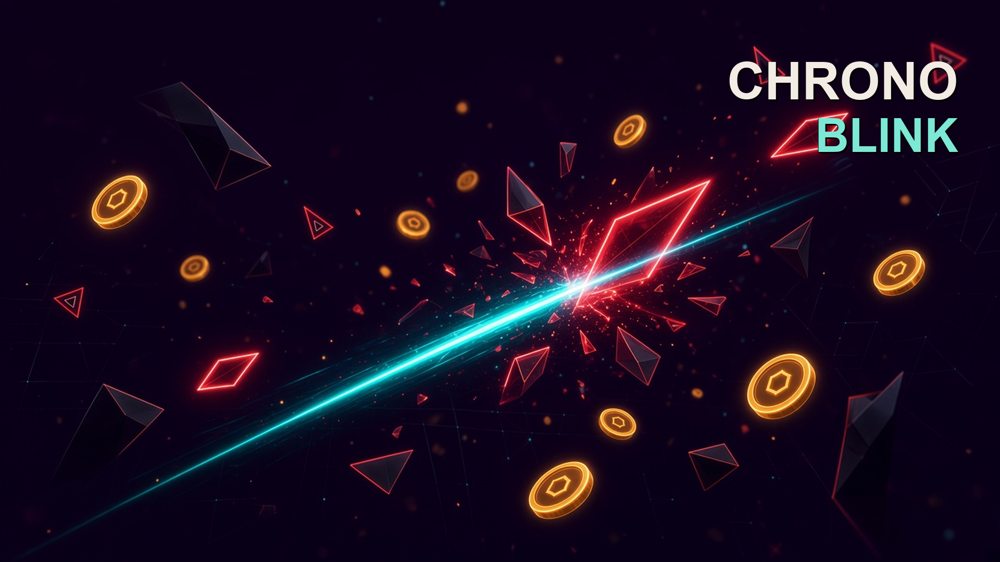
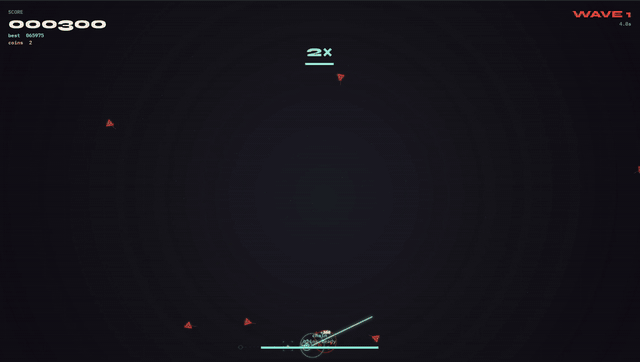
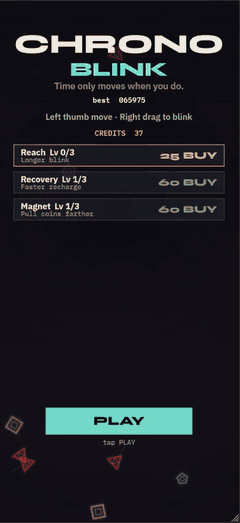

# CHRONO BLINK

A top-down HTML5 arena where time only flows when you move, and a blink-dash is both your sword and your exit.

<p align="center">
  
</p>

<p align="center">
  <br/>
  <em>Desktop / landscape</em>
</p>

<p align="center">
  <br/>
  <em>Phone / portrait</em>
</p>

<p align="center">
  <strong>Open <code>index.html</code> in a browser.</strong><br/>
  No install, no build. Clone the repo, then double-click the file.
</p>

## Quick start

1. Clone this repo and open `index.html` (double-click, or drag it onto a browser).
2. Stand still. Time crawls. Move, and the arena wakes up.
3. Blink through something. A hit refunds the dash. A miss costs 1.2s.

That's the whole game. First run has a skippable in-game tutorial.

## Controls

| | Desktop | Phone |
|---|---|---|
| Move | WASD, ZQSD, or arrows | Left thumb |
| Blink | Space or right click toward the reticle | Right-side drag, then release |
| Mute | `M` | — |
| Skip tutorial | `X` | Tap skip |

## Features

- **Time holds when you stop.** Idle world time is 0.08×, full speed only while you move or blink. The shift is lerped, not a hard pause.
- **The dash is the weapon.** A blink is a short invulnerable lunge. Slice an enemy (or an orb) and the cooldown refunds. Whiff and you sit in 1.2s of lockout.
- **Three readable threats.** Crimson stalkers chase, amber gunners telegraph shots, violet phantoms dart. Shape, color, and a charge cue are meant to match.
- **Coins bank into Reach / Recovery / Magnet.** Spend between runs. The shop reflows: two columns in short landscape, stacked in portrait.
- **Keyboard and thumbs.** AZERTY is first-class. Phone dash distance is capped so the landing reticle stays on screen.
- **CrazyGames-ready, file://-safe.** The CrazyGames SDK only loads on CrazyGames (or localhost / `?cg=1` for testing). Everywhere else — itch, GitHub, `file://` — the game never fetches it and just uses `localStorage`.

## Run it locally

Any current Chromium, Firefox, or Safari. No Node, no build, no env vars.

```bash
git clone https://github.com/Ander507/CHRONO---BLINK.git
```

Then open `index.html`. `file://` works. Fonts load from Google Fonts if you're online; the game still runs if they don't.

For a local server (optional):

```bash
npx --yes serve .
```

Progress keys live in `localStorage` (`chronoBlink.*`). Wipe them from the browser if you want a fresh tutorial / bank.

## How it works

The whole game is one canvas in one HTML file. No engine.

World simulation uses a time scale that eases between `0.08` (idle) and `1.0` (moving). Combos and dash cooldown run on *real* seconds on purpose — hiding in slow-mo still burns your chain. A blink is a line segment tested against enemy circles, with extra pad so a 240px lunge doesn't feel pixel-exact.

The expensive stuff is gated. Device pixel ratio is capped at 1.5 so phone glow doesn't 3× the fill cost. Scanlines are a 1×4 repeating pattern instead of a `fillRect` per row. Chromatic aberration uses two spare canvases and only composites while the punch is actually visible — leaving it on as a simmer meant a triple-canvas path every frame.

On rotate, resize waits ~120ms because mobile browsers still report the old viewport if you measure on the orientation event.

## Credits

Fonts: [Syne](https://fonts.google.com/specimen/Syne), [IBM Plex Sans](https://fonts.google.com/specimen/IBM+Plex+Sans), [IBM Plex Mono](https://fonts.google.com/specimen/IBM+Plex+Mono).

Optional platform: [CrazyGames SDK](https://docs.crazygames.com/sdk/html5/).
